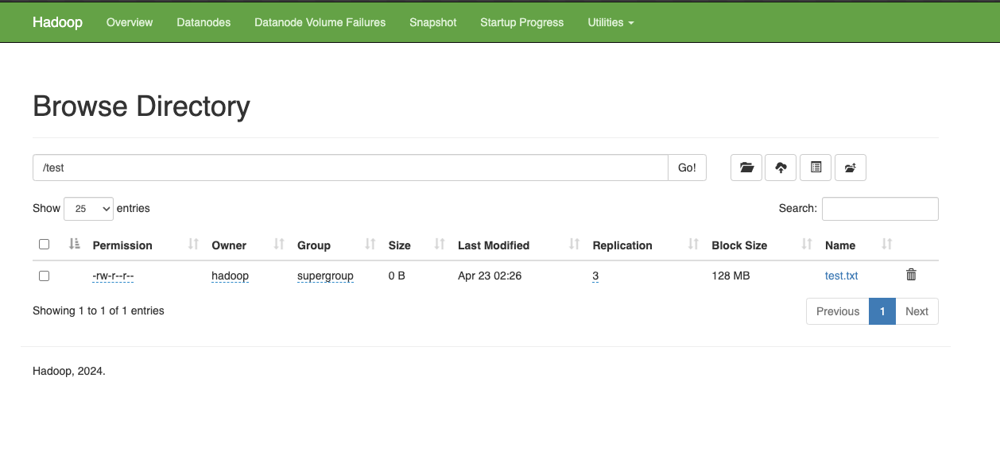
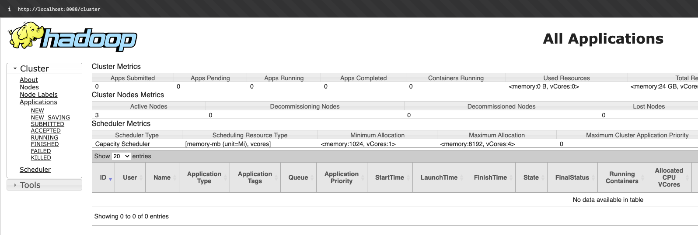
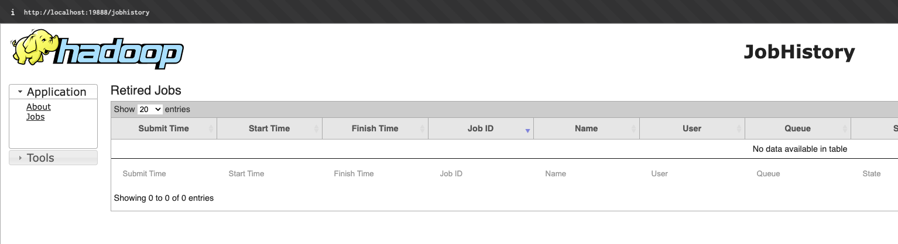

# HW-02

узел для входа 176.109.91.22

```
192.168.1.82 team-20-jn
192.168.1.83 team-20-nn
192.168.1.84 team-20-dn-00
192.168.1.85 team-20-dn-01
```

Развернуть YARN и опубликовать веб-интерфейсы основных и вспомогательных демонов кластера для внешнего использования.

## Подготовка
Подразумевается, что сервисы hadoop к данному этапу запущены и исправно функционируют

> На team-20-jn от пользователя team:
```sh
01-hadoop-web.sh
```
> Web-интерфейс доступен на localhost:9870 после команды:
```sh
ssh -L 9870:127.0.0.1:9870 team@<узел-для-входа>
```
**Подробнее:**

### Web-интерфейс
На -jn с пользователя team создаем новую конфигурацию для nginx из default:
```sh
sudo cp /etc/nginx/sites-available/default /etc/nginx/sites-available/nn
```

В файле ```/etc/nginx/sites-available/nn``` изменяем:
```nginx
server {
	listen 9870;
    # ...
    location / {
		auth_basic	"Administrator's Area";
		auth_basic_user_file /etc/.htpasswd;
		proxy_pass http://team-20-nn:9870;
	}
    # ...
}
```

Задаем данные для входа в админ-панель:
```sh
sudo apt install apache2-utils # Установка htpasswd
sudo htpasswd -c /etc/.htpasswd admin # Создание пользователя admin
```

Применяем конфигурацию nginx:
```sh
sudo ln -s /etc/nginx/sites-available/nn /etc/nginx/sites-enabled/
sudo nginx -t # Выводит OK
sudo systemctl reload nginx
```

Запускаем веб-сервис с локальной машины:
```sh
ssh -L 9870:127.0.0.1:9870 team@<узел-для-входа>
```

По адресу ```127.0.0.1:9870``` становится доступен веб-интерфейс. В ```Utilities -> Browse File System``` можем видеть созданные раннее файлы в узле:



## Настройка YARN

> На team-20-jn от пользователя hadoop
```sh
02-yarn-config.sh
```
**Подробнее:**

### Настройка конфигурации
На -jn переходим на пользователя hadoop
```sh
sudo -i -u hadoop
```

Изменяем в файле ```~/hadoop-3.4.0/etc/hadoop/yarn-site.xml```:
```xml
<configuration>
        <property>
                <name>yarn.nodemanager.aux-services</name>
                <value>mapreduce_shuffle</value>
        </property>
        <property>
                <name>yarn.nodemanager.env-whitelists</name>
                <value>JAVA_HOME,HADOOP_COMMON_HOME,HADOOP_HDFS_HOME,HADOOP_CONF_DIR,CLASSPATH_PREPEND_DISTCACHE,HADOOP_YARN_HOME,HADOOP_HOME,PATH,LANG,TZ,HADOOP_MAPRED_HOME</value>
        </property>
        <property>
                <name>yarn.resourcemanager.hostname</name>
                <value>team-20-nn</value>
        </property>
        <property>
                <name>yarn.resourcemanager.address</name>
                <value>team-20-nn:8032</value>
        </property>
        <property>
                <name>yarn.resourcemanager.resource-tracker.address</name>
                <value>team-20-nn:8031</value>
        </property>
</configuration>
```

Изменяем в файле ```~/hadoop-3.4.0/etc/hadoop/mapred-site.xml```:
```xml
<configuration>
        <property>
                <name>mapreduce.framework.name</name>
                <value>yarn</value>
        </property>
        <property>
                <name>mapreduce.application.classpath</name>
                <value>$HADOOP_HOME/share/hadoop/mapreduce/*:$HADOOP_HOME/share/hadoop/mapreduce/lib/*</value>
        </property>
</configuration>
```

Распространяем конфигурации по узлам:
```sh
scp /home/hadoop/hadoop-3.4.0/etc/hadoop/yarn-site.xml <имя-узла>:/home/hadoop/hadoop-3.4.0/etc/hadoop/yarn-site.xml
scp /home/hadoop/hadoop-3.4.0/etc/hadoop/mapred-site.xml <имя-узла>:/home/hadoop/hadoop-3.4.0/etc/hadoop/mapred-site.xml
```

## Запуск YARN

> На team-20-nn от пользователя hadoop
```sh
03-run-yarn.sh
```
> На team-20-jn от team
```sh
04-setup-web.sh
```
> Web-интерфейсы доступны на портах localhost 8088 и 19888 после команды:
```sh
ssh -L 9870:127.0.0.1:9870 -L 8088:127.0.0.1:8088 -L 19888:127.0.0.1:19888 team@176.109.91.22  
```
**Подробнее:**

### Запуск
На -nn c пользователя hadoop:
```sh
~/hadoop-3.4.0/sbin/start-yarn.sh
```

### Проверка
Проверяем, что сервисы запущены:
```sh
$ jps
15169 SecondaryNameNode
14961 DataNode
47078 ResourceManager # Новый сервис YARN
47578 Jps
47229 NodeManager # Новый сервис YARN
14782 NameNode
```

На дочернем узле:

```sh
$ jps
34928 DataNode
43394 NodeManager # Новый сервис YARN
43571 Jps
```

### Запуск historyserver
На -nn c пользователя hadoop:
```sh
$ mapred --daemon start historyserver
$ jps

15169 SecondaryNameNode
14961 DataNode
47652 JobHistoryServer # Запущен
47078 ResourceManager
47719 Jps
47229 NodeManager
14782 NameNode
```

### Настройка web-интерфейса
На -jn c пользователя team создаем новые конфиги nginx:
```sh
sudo cp /etc/nginx/sites-available/nn /etc/nginx/sites-available/ya
sudo cp /etc/nginx/sites-available/nn /etc/nginx/sites-available/dh
```

В ```/etc/nginx/sites-available/ya``` (ResourceManager) меняем порты:
```nginx
# ...
listen 8088;
# ...
proxy_pass http://team-20-nn:8088;
```

В ```/etc/nginx/sites-available/dh``` (HistoryServer) меняем порты:
```nginx
# ...
listen 19888;
# ...
proxy_pass http://team-20-nn:19888;
```

Применяем конфигурацию nginx:
```sh
sudo ln -s /etc/nginx/sites-available/ya /etc/nginx/sites-enabled/
sudo ln -s /etc/nginx/sites-available/dh /etc/nginx/sites-enabled/
sudo nginx -t # Выводит OK
sudo systemctl reload nginx
```

Пересоздаем сессию с новыми портами:
```sh
ssh -L 9870:127.0.0.1:9870 -L 8088:127.0.0.1:8088 -L 19888:127.0.0.1:19888 team@176.109.91.22  
```

Видим интерфейсы сервисов:

