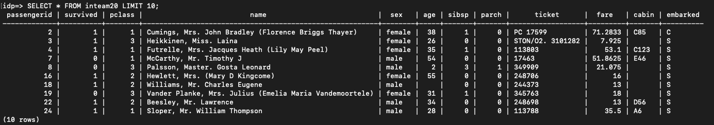

# HW-05

## Передаем данные
hadoop@team-20-jn:
```sh
scp titanic.csv user@91.185.85.179:/home/user/team-20-data/
```

>user@greenplum-centos
```sh
01-setup-greenplum.sh
```

**Подробнее:**

## Запуск gpfdist
user@greenplum-centos:
```sh
gpfdist -d /home/user/team-20-data -p 8081 &
```

## Подключаемся к БД
user@greenplum-centos:
```sh
psql -d idp
```

Создаем внешнюю таблицу
```sql
CREATE EXTERNAL TABLE team20 ( --Намудрил с названиями)
  PassengerId INT,
  Survived INT,
  Pclass INT,
  Name TEXT,
  Sex TEXT,
  Age FLOAT,
  SibSp INT,
  Parch INT,
  Ticket TEXT,
  Fare FLOAT,
  Cabin TEXT,
  Embarked TEXT
) LOCATION ('gpfdist://localhost:8088/titanic.csv') FORMAT 'CSV' (HEADER);
```

Создаем внутреннюю таблицу
```sql
CREATE TABLE inteam20 ( --Намудрил с названиями)
  PassengerId INT,
  Survived INT,
  Pclass INT,
  Name TEXT,
  Sex TEXT,
  Age FLOAT,
  SibSp INT,
  Parch INT,
  Ticket TEXT,
  Fare FLOAT,
  Cabin TEXT,
  Embarked TEXT
);
INSERT INTO inteam20 SELECT * FROM team20;
```

## Проверка
```sql
SELECT * FROM inteam20 LIMIT 10;
```

и все готово
